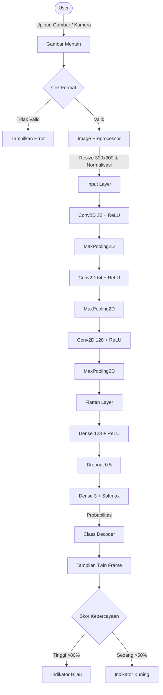

# 🧠 CogniDesk: AI Stationery Detector

**CogniDesk** adalah sistem *computer vision* cerdas yang dirancang untuk mengklasifikasikan alat tulis (**Penghapus, Kertas, Pensil**) secara otomatis dan *real-time*. Sistem ini dibangun menggunakan **Convolutional Neural Network (CNN) kustom** dan dibungkus dalam antarmuka modern berbasis **Streamlit** dengan gaya **Google Material Design**.

---

## 📸 Demo Preview

> *Tampilan Dashboard*
> *Hasil Prediksi*

*(Ganti placeholder ini dengan screenshot asli dari aplikasi)*

---

## 🏗️ Arsitektur Sistem & Alur Kerja

Proyek ini menggunakan *deep learning pipeline* yang terdiri dari tiga tahap utama:

1. **Pra-pemrosesan Data (Data Preprocessing)**
2. **Ekstraksi Fitur menggunakan CNN**
3. **Inferensi dan Visualisasi Hasil**

---

## 🧜‍♂️ Diagram Alur Sistem (Mermaid)



---

## 🧠 Detail Model Deep Learning

Model dikembangkan menggunakan **TensorFlow / Keras** dengan arsitektur sebagai berikut:

### Input & Pra-pemrosesan

* **Ukuran Input**: `(300, 300, 3)`
* **Rescaling**: Normalisasi nilai piksel dari `[0, 255]` menjadi `[0, 1]`

### Ekstraksi Fitur (3 Blok Konvolusi)

* **Blok 1**: `Conv2D (32 filter, kernel 3×3)` + `MaxPooling (2×2)`
* **Blok 2**: `Conv2D (64 filter, kernel 3×3)` + `MaxPooling (2×2)`
* **Blok 3**: `Conv2D (128 filter, kernel 3×3)` + `MaxPooling (2×2)`
* **Fungsi Aktivasi**: ReLU

### Kepala Klasifikasi

* **Flatten Layer**: Mengubah feature map 2D menjadi vektor 1D
* **Dense Layer**: 128 neuron
* **Dropout**: 0.5 untuk mengurangi overfitting
* **Output Layer**: 3 neuron dengan aktivasi **Softmax**

**Kelas Target**:

* `Eraser (Penghapus)`
* `Kertas`
* `Pensil`

---

## 🚀 Fitur Utama

* **Dukungan Dual Input**: Upload gambar atau ambil langsung dari webcam
* **Twin-Frame Analysis**: Perbandingan visual antara gambar asli dan hasil prediksi
* **Pra-pemrosesan Otomatis**: Lanczos resampling dan konversi RGB
* **Antarmuka Modern**: CSS kustom bergaya Google Material Design
* **Penanganan Error**: Mode demo otomatis jika TensorFlow tidak terdeteksi

---

## 📂 Struktur Proyek

```bash
.
├── app/
│   ├── components/         # Logika prediksi & pemrosesan gambar
│   ├── config.py           # Konfigurasi aplikasi
│   └── main.py             # Layout UI Streamlit
├── dataset_alat_tulis/     # Dataset mentah per kelas
├── docs/                   # Dokumentasi pendukung
├── models/                 # Model tersimpan (.keras) & script training
├── samples/                # Contoh gambar untuk pengujian
├── streamlit_app.py        # Entry point aplikasi
├── requirements.txt        # Dependensi Python
└── README.md               # Dokumentasi proyek
```

---
## 📊 Performa Model

| Metrik    | Nilai | Keterangan               |
| --------- | ----- | ------------------------ |
| Akurasi   | ~92%  | Data Validasi            |
| Loss      | 0.24  | Categorical Crossentropy |
| Optimizer | Adam  | Learning Rate: 0.001     |

> **Catatan**: Model dilatih menggunakan dataset kustom alat tulis dengan teknik *data augmentation* untuk meningkatkan kemampuan generalisasi.


---

## 🛠️ Instalasi & Menjalankan Aplikasi

Ikuti langkah berikut untuk menjalankan **CogniDesk** secara lokal:

### 1️⃣ Clone Repository

```bash
git clone https://github.com/yourusername/cnn-custom-datagambar.git
cd cnn-custom-datagambar
```

### 2️⃣ Membuat Virtual Environment (Opsional, Direkomendasikan)

```bash
python -m venv venv

# Windows
venv\Scripts\activate

# macOS / Linux
source venv/bin/activate
```

### 3️⃣ Install Dependensi

```bash
pip install -r requirements.txt
```

### 4️⃣ Menjalankan Aplikasi

```bash
streamlit run streamlit_app.py
```


---

## 👨‍💻 Tim Pengembang

Dibuat dengan ❤️ oleh **Tim CogniDesk**:

* **Izza** — Lead AI Engineer
* **Haikal** — Backend & Data Pipeline
* **Hermawan** — Frontend & UI/UX

---

<p align="center">© 2025 Proyek CogniDesk. Seluruh Hak Dilindungi.</p>
